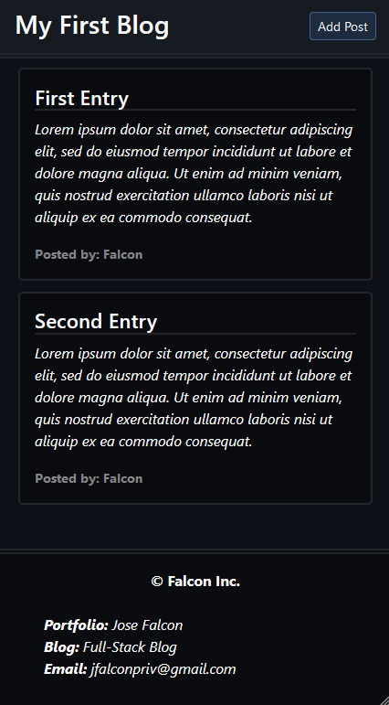

# blog-webpage

## Description

blog-webpage is a simple, responsive web application that allows users to create and view blog posts. It is designed with web technologies like HTML, CSS, JavaScript, and Bootstrap. This allows it to be user friendly. The project is structured to demonstrate the use of client-side scripting and styling in building a basic blogging platform. The project uses the following file structure:

```md
blog-webpage
├── assets
│   ├── css
│   │   ├── blog.css
│   │   ├── form.css
│   │   └── styles.css
│   └── js
│       ├── blog.js
│       ├── form.js
│       └── logic.js
├── index.html
├── blog.html
└── README.md
```


## Features

- User-friendly form to create blog posts
- Dynamic display of blog entries
- Custom CSS for unique styling
- Utilizes Bootstrap for responsive design
- JavaScript for client-side form handling and dynamic content update

## Mock-Up

### Blog Form Page (index.html)

The blog form page allows users to input their username, blog title, and blog content. It includes a header with a theme toggle switch, a form section for blog input, and buttons to post or view blogs.


### Blog Display Page (blog.html)

The blog display page shows a list of blog entries. It includes a header with the blog title and a button to add a new post, a main section displaying blog posts, and a footer with contact and portfolio links.



## Learning Outcomes

- Understanding of HTML structure and semantics
- Practical use of CSS for styling and layout
- Application of JavaScript for DOM manipulation and event handling
- Integration of Bootstrap for responsive and modern design
- Experience in structuring a web project with multiple assets and files

## Usage

1. Clone the repository to your local machine:
    ```bash
    git clone https://github.com/your-username/my-blog.git
    ```
2. Navigate to the project directory:
    ```bash
    cd my-blog
    ```
3. Open `index.html` in your preferred web browser to access the blog form page.
4. Fill in the form with your blog details and click "Post your blog" to save entry.
5. Click "View blogs" to navigate to the blog display page (`blog.html`) where all blog entries are listed.

## License

This project is licensed under the MIT License.